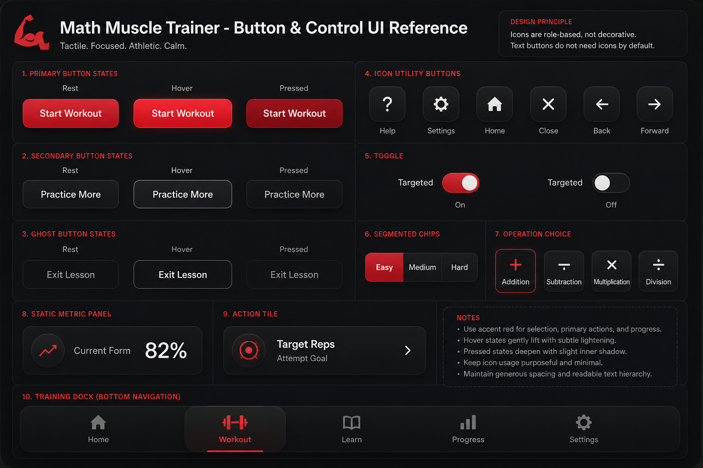

# Current Button UI Reference

Last updated: 2026-07-11

This document is a temporary implementation audit and baseline. It is not a competing design authority.

Use it to compare the current UI against the canonical rules in `visual-design-system.md`, the ownership model in `component-system.md`, and the screenshot evidence under `reference/`.

## Current Baseline Purpose

- document the implemented control/button baseline
- note where the current app already aligns well
- capture known gaps that future UI work should address

## Visual Reference

Use `docs/design/reference/button-ui-design-brief.jpg` as the current control-reference board for shape, spacing, density, hierarchy, and states.

The icons shown inside that board are examples only, not canonical product icons.

## Current Implemented Read

- rounded pill-style primary and secondary controls
- compact rounded dock with `Home`, `Workout`, `Learn`, `Progress`, and a dock Options gear
- soft dark surfaces with theme-driven accent color
- text-first buttons by default
- selective visual anchors where the symbol carries direct meaning
- static metric panels separated from action tiles

## Current Role Snapshots

### Primary

- current examples: Setup `Start`, Practice `Check`, confirm actions in dialogs
- current watch item: keep one dominant primary action per local decision area

### Secondary / Action Tile

- current examples: setup choices, lesson cards, training modules, tracker training cards
- current watch item: keep contained items clearly tappable without letting them compete with the primary action

### Dock

- current examples: `Home`, `Workout`, `Learn`, `Progress`, dock Options gear
- current watch item: keep the dock compact, centered, and readable on the iPad frame

### Ghost

- current examples: quiet exits, cancel actions, and similar lower-emphasis actions
- current watch item: stay discoverable without reading as the main CTA

### Icon Utility

- current examples: dock Options gear, carousel arrows, calendar month arrows, info/help controls
- current watch item: keep global utilities and local utilities distinct

### Static Metrics

- current examples: Home snapshot metrics, tracker summary values, results summary metrics
- current watch item: avoid hover/lift/tappable styling

## Known Gaps

- the runtime still uses historical class names rather than the cleaner future contract names
- Learn, Progress, and Options still need fuller dedicated reference coverage
- some control groups still need later cleanup against the hybrid ownership and token rules

## Documentation Status

- treat this file as a baseline audit
- update it when the implemented control language materially changes
- do not use it to override the canonical rules in `visual-design-system.md`
